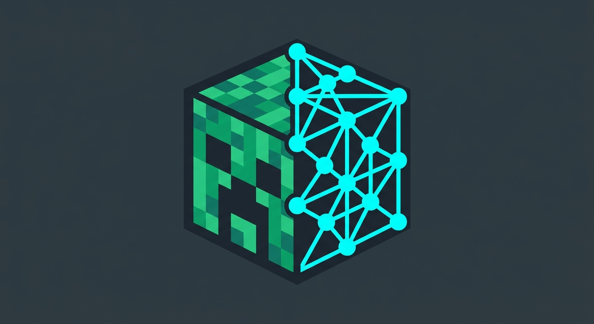

<p align="center">
  
</p>

# Blockhead — CobbleBob, an autonomous Minecraft companion

A TypeScript/Mineflayer agent that joins a Minecraft Java server as CobbleBob.
A local llama.cpp model reads owner chat and picks from a fixed set of
high-level tools; deterministic skills and Mineflayer code do the actual work.
It is a working end-to-end prototype under active development.

## How it works

```text
owner chat / background director
            ↓
LLM decision → validated tool → scheduler / task lease
                                      ↓
                              deterministic skill
                                      ↓
                          Mineflayer world primitives
```

The model never emits code, commands, or block coordinates — only a validated
tool call. Priority is safety/self-maintenance > owner work > background work.
Background maintenance keeps wood, food, fuel, and torches at target levels; an
LLM director proposes idle work, with deterministic fallbacks if the model is
down.

| Path | Role |
| --- | --- |
| `src/llm/` | llama.cpp client, prompt/context building, decision validation |
| `src/tools/` | Registry of actions the model may select |
| `src/agent/` | Scheduler, task dispatch, goals, bootstrap, maintenance, survival interrupts, watchdog, reconnects |
| `src/skills/` | Multi-step work: gathering, food, crafting/smelting, storage, building, combat, delivery, death recovery |
| `src/building/` | Declarative `BuildingDesign` schema, validation, templates, compiler |
| `src/terrain/` | Terrain geometry, classification, verified block mutation |
| `src/minecraft/` | Mineflayer wrappers: movement, inventory, containers, world, creative mode |
| `src/policy/` | Hard safety rules checked before dangerous actions |
| `src/memory/` | SQLite persistence: tasks, goals, projects, locations, storage, deaths, skills |
| `src/dashboard/`, `src/tui/`, `src/status/` | Read-only web dashboard + viewer, terminal UI, status endpoint |

## Capabilities

- Persistent, resumable tasks and goals (queued → active/paused/blocked → done/failed/cancelled).
- Resumable bootstrap: tools, food, bed, storage, furnace, fuel, torches, opportunistic iron.
- Gathering, hunting, crafting, smelting, storage organization, delivery,
  following, navigation, defense, and death-item recovery.
- Building: `build_structure` for simple rooms/walls/towers, `build_design` for
  compiled, resumable architectural designs (see [docs/building-architecture.md](docs/building-architecture.md)).
- Terrain projects: `clear_area`, `flatten_area`, `excavate_volume` (≤ 8,192
  blocks), and `dig_mineshaft` (stair corridor). Geometry is frozen up front,
  progress checkpoints through interrupts, and results are verified in-world.
  Water, lava, falling/unbreakable blocks, protected fixtures, or unsafe access
  block the project rather than being guessed through.
- Safeguards for the protected home, health, lava, dimensions, PvP, inventory,
  pathing, and timeouts, plus an anti-loop watchdog for repeated failures.

## Run locally

Requirements: Node.js 20+, a Minecraft Java server, and a llama.cpp (or other
OpenAI-compatible) endpoint.

```bash
npm install
```

```bash
npm run llm
```

Edit [`config/minecraft.yaml`](config/minecraft.yaml) — at minimum the server,
username, owner, home coordinates, and `llm.base_url` — then:

```bash
npm start
```

State lives in `data/blockhead.db`, logs in `logs/`. Config is validated with
Zod at startup; prompts in [`prompts/`](prompts/) can be tuned without code
changes (built-in fallbacks exist).

## Dashboard, viewer, and TUI

Configured under `dashboard` in the config; all read-only — the browser cannot
control the bot.

| Service | Default | Notes |
| --- | --- | --- |
| Dashboard | `127.0.0.1:3000` | `/`, `/api/state`, `/ws`, `/health` |
| World viewer | `127.0.0.1:3001` | Live prismarine-viewer while connected |
| Public viewer | `:3003`, off | Redacted, loopback-only, for Tailscale Funnel (`dashboard.public_viewer`) |
| Status endpoint | `127.0.0.1:8155` | Small process/task health snapshot |

A terminal dashboard runs when stdout is a TTY (`tui.enabled`).

## Tests

```bash
npm test
```

```bash
npm run typecheck
```

`npm run creative:smoke` is an optional live check against a disposable
creative server (see [docs/creative-provisioning.md](docs/creative-provisioning.md)).

## Docs

- [docs/deployment-maia.md](docs/deployment-maia.md) — deployment and service commands
- [docs/building-architecture.md](docs/building-architecture.md) — declarative building pipeline
- [docs/world-action-call-graph.md](docs/world-action-call-graph.md) — world action call graph
- [docs/creative-provisioning.md](docs/creative-provisioning.md) — creative material provisioning
